# NICESTART

## Descripción del Proyecto
Nicestart es una aplicación Android sencilla que proporciona una estructura básica para el desarrollo de aplicaciones móviles. Incluye pantallas principales como **Login**, **Registro** y **Main**, además de diversos menús, barras de navegación y fragments.

El proyecto está organizado en **ramas** para facilitar su desarrollo y mantenimiento.

---

## Funcionamiento

### 🖥️ Pantalla Splash
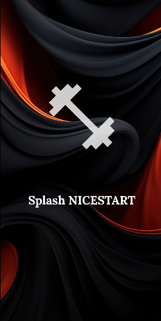

Al iniciar la app, aparece esta pantalla con el logo de la aplicación parpadeando durante unos segundos.

---

### 🔐 Pantalla de Login
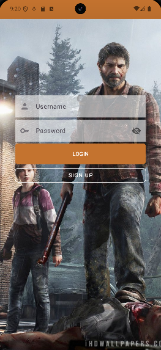

Permite a los usuarios ingresar sus credenciales de acceso.
- Contiene campos de texto para **usuario** y **contraseña**.
- Incluye un botón para **iniciar sesión**.

---

### 🆕 Pantalla de Registro
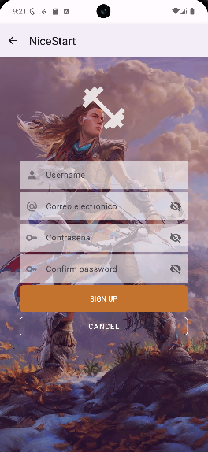

Permite la creación de una nueva cuenta.
- Campos para **nombre de usuario**, **correo electrónico** y **contraseña**.
- Botones para **registrarse** y **volver a la pantalla de login**.

---

### 🏠 Pantalla Principal (Main)

Accesible desde la pantalla de login o registro.
- **No permite regresar a la pantalla de Login**.

---

### 📋 Menús y Navegación

#### 📑 Cuadro de Diálogo
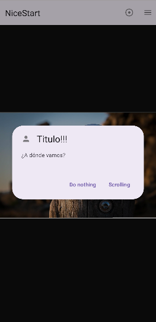

Este menú abre una ventana emergente con dos opciones:
- **Scrolling**: Redirige a otra pantalla (por defecto, regresa al Login).

#### 📌 Menú Appbar
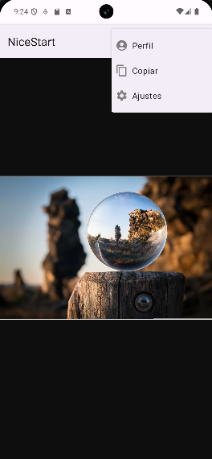

Opciones disponibles:
1. **Perfil** → Accede a la pantalla "Profile".
2. **Ajustes** → Muestra un mensaje emergente.
3. **Copiar** → Muestra un mensaje emergente.
4. **Menú Fragments** → Redirige al activity con las cuatro páginas.

#### 📂 Menú Contextual
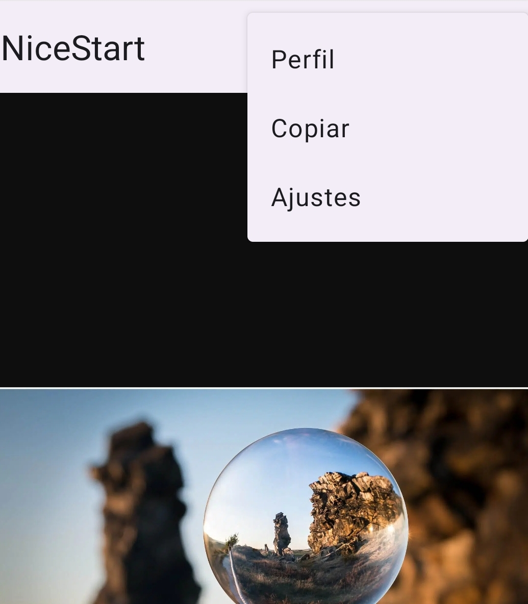

Similar al menú Appbar, pero sin los íconos en las opciones.

---

### 👤 Pantalla Profile
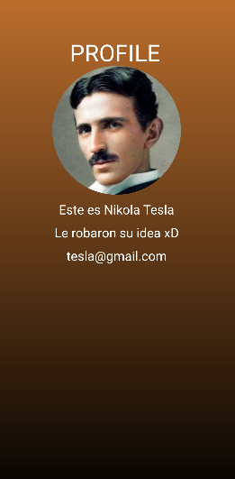

Muestra la información del usuario:
- **Foto de perfil (circular)**
- **Nombre**
- **Descripción**
- **Correo electrónico**

Se accede desde el menú Appbar en la opción **"Perfil"**.

---

### 🔄 Funcionalidades Adicionales

#### 🔄 Refresh
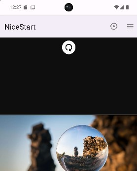

En la pantalla Main, al arrastrar hacia abajo se refresca la página.

#### 🌙 Modo Noche
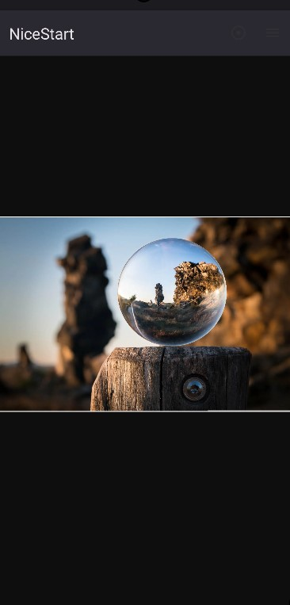

Modo oscuro que cambia el fondo a negro y ajusta los colores para una mejor visualización nocturna.

#### 🧩 Fragments

    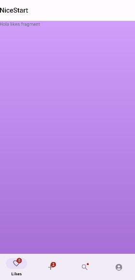
    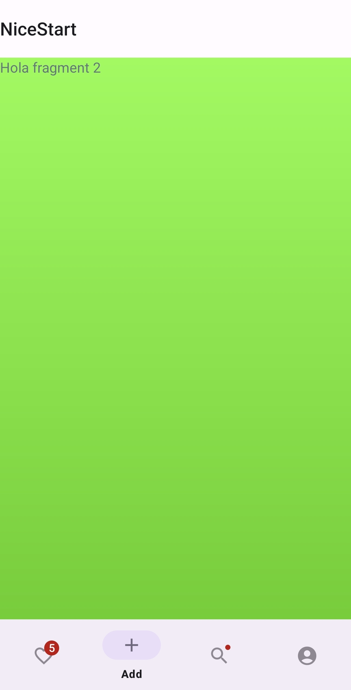
    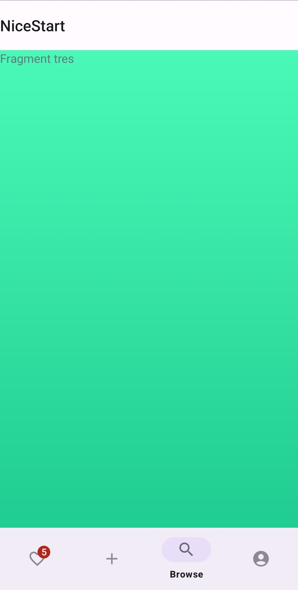
    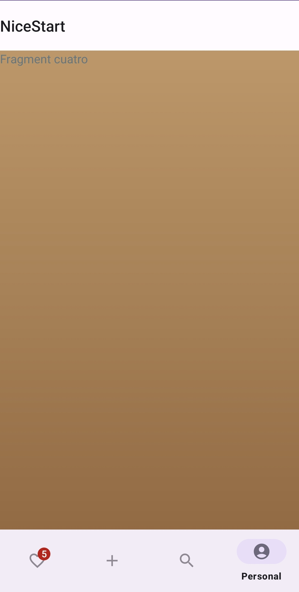

Los fragments son pequeñas piezas dentro de un Activity. En Nicestart, cada fragment se relaciona con un apartado del **Bottom Navigation Menu**.

#### 📌 Bottom Navigation Menu
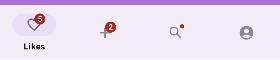

Este menú permite la navegación entre diferentes fragments sin necesidad de cambiar de Activity.

#### 🔄 Section Pager Adapter
Este adaptador gestiona la navegación entre fragments. En el método `getItem()`, retorna el fragment correspondiente (Page1, Page2, etc.) según la posición.

---

### 🌍 Idiomas
La aplicación está disponible en **Francés de Francia**, además del idioma predeterminado.

---

📌 **Nicestart ofrece una base sólida para el desarrollo de aplicaciones Android, facilitando la integración de elementos esenciales como login, navegación y personalización visual.** 🚀
